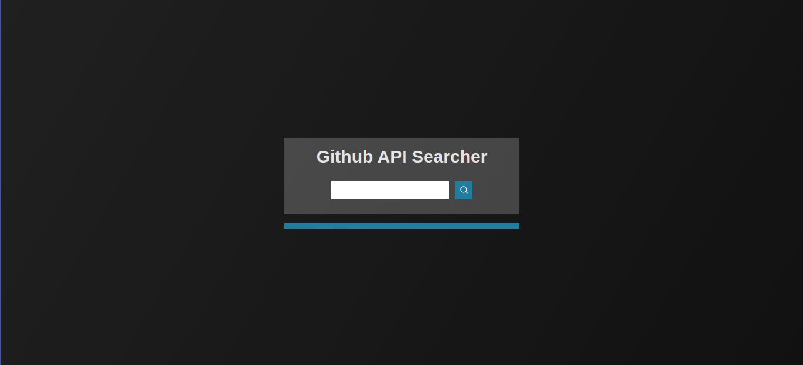

<h1 align="center">Github API Searcher  </img></h1>

<p >
  Aplicação desenvolvida para retornar dados públicos do Github de um determinado usuário. 
</p>

<h2> Tecnologias e bibliotecas utilizadas: </h2>

- ReactJS
- Styled-Components
- Context API
- Axios
- Gradient Colors
- React Navigation

## Pré-requisitos:

- Node.js
- Yarn

## Como utilizar:

Clone o repositório

```bash
# Abra o terminal e digite esse comando ou faça download do projeto
$ git clone https://github.com/leondavidtb/github-api.git
```

Entre na pasta do projeto

```bash
$ cd github-api
```

Instale as dependências

```bash
$ yarn
```

Inicie a aplicação

```bash
$ yarn start
```

## Screenshots da aplicação

### Tela inicial

<p align="center"  >
  
</p>

### Detalhes do usuário

<p align="center"  >
  
</p>

### Repositórios

<p align="center"  >
  
</p>

### Favoritos

<p align="center"  >
  
</p>

</br>

<p align="center">Desenvolvido com ☕ por <a href="https://github.com/leondavidtb">Leonardo David </a>
<div align="center">
 </div>
